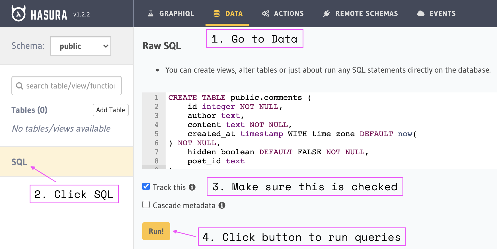
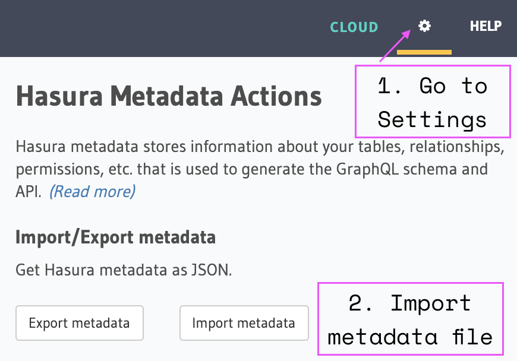

# useComments

React hook to effortlessly add a comment section to your website, and start the
discussion on your content.

```jsx
const Comments = ({ postId }) => {
  const { comments, addComment, count, loading } = useComments(
    'https://<YOUR_HASURA_APP>.herokuapp.com/v1/graphql',
    postId
  );

  return (
    <section>
      <AddComment onSubmit={addComment} />
      <h3>{count} comments</h3>
      {loading ? (
        'Loading...'
      ) : (
        <div>
          {comments.map(({ author, content, created_at, status }) => (
            <article key={created_at}>
              <div>
                {`${author} ・ `}
                <time dateTime={created_at}>{formatDate(created_at)}</time>
                {status && ` ・ ${formatStatus(status)}`}
              </div>
              <p>{content}</p>
            </article>
          ))}
        </div>
      )}
    </section>
  );
};
```

## Getting started

1. **Deploy Hasura**

   Click this 👇 to deploy a fresh [Hasura] instance.

   <a href="https://heroku.com/deploy?template=https://github.com/hasura/graphql-engine-heroku">
   Deploy Hasura to Heroku </a>

   We need to keep all of these comments somewhere, right? Hasura handles this
   for us.

   Check out [the docs][hasura-docs] for more details. You can find more options
   for one-click deployment there.

   [hasura]: https://hasura.io

   [hasura-docs]:
   https://hasura.io/docs/1.0/graphql/manual/guides/deployment/heroku-one-click.html

2. **Set config vars in Heroku**

   In order to use our Hasura backend we need to set two enviromental variables
   in Heroku.
   [`HASURA_GRAPHQL_ADMIN_SECRET`](https://hasura.io/docs/1.0/graphql/manual/deployment/heroku/securing-graphql-endpoint.html#heroku-secure)
   will make sure that your GraphQL endpoint and the Hasura console are not
   publicly accessible.
   [`HASURA_GRAPHQL_UNAUTHORIZED_ROLE`](https://hasura.io/docs/1.0/graphql/manual/auth/authentication/unauthenticated-access.html#unauthenticated-access)
   will allow unauthenticated (non-logged in) users add and view comments.

   

3. **Import database schema and metadata**

   In the next step we need to import database schema. Click
   [here](https://github.com/beerose/use-comments/blob/master/hasura/up.sql) and
   copy paste the content.

   

   We also need to import Hasura metadata to set all the permissions. Save this
   file, and import it in Hasura Console:

   

4. **Install `use-comments`**

   ```
   npm install use-comments
   ```

   ```
   yarn add use-comments
   ```

   or add it from CDN

   ```
   <srcript src="https://unpkg.com/use-comments@0.1.2/dist/index.modern.js" />
   TODO: Example with unpkg and global variable `useComments`.
   ```

5. **Create beautiful UI for your comments**

   Start off from one of the examples or write it from scratch.

   - [Theme UI](https://codesandbox.io/s/use-comments-theme-ui-demo-hjqqj)
   - [Tailwind](https://codesandbox.io/s/use-comments-demo-tailwind-pvhgw)

## API reference

### `useComments`

Fetches comments from Hasura backend specified in `hasuraUrl` on mount and
whenever `config.limit` or `config.offset` change.

**Parameters**

- **hasuraUrl**: URL of the Hasura instance
- **postId**: Comments will be fetched for the post with id `postId`
- **config**: Configurable offset and limit for the GraphQL query to Hasura. See
  [`UseCommentsConfig`](#use-comments-config)

**TypeScript Signature**

```ts
const useComments: (
  hasuraUrl: string,
  postId: string,
  config?: UseCommentsConfig | undefined
) => UseComentsResult;
```

**Returns `UseComentsResult`**

```ts
interface UseComentsResult {
  comments: Comment[];
  addComment: ({
    content,
    author,
  }: Pick<Comment, 'content' | 'author'>) => void;
  refetch: () => void;
  count: number;
  loading: boolean;
  error: UseCommentsError | null;
}
```

### `Comment`

```ts
export interface Comment {
  post_id: string;
  author: string;
  content: string;
  created_at: string;
  status?: CommentStatus;
}
```

### `UseCommentsConfig`

```ts
export interface UseCommentsConfig {
  limit?: number;
  offset?: number;
}
```

### `CommentStatus`

```ts
export declare type CommentStatus =
  | 'sending'
  | 'added'
  | 'delivered-awaiting-approval'
  | 'failed';
```

### `UseCommentsError`

```ts
interface UseCommentsError {
  error: string;
  details: string;
}
```
