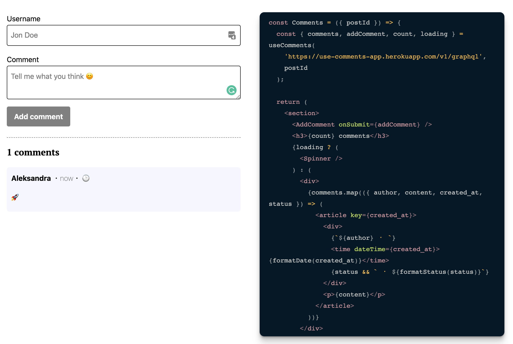

# useComments

React hook to effortlessly add a comment section to your website, and start the
discussion on your content.

### Demo: https://use-comments.netlify.app/



# What is it?

### 🎃 Headless React Hook

`useComments` just cares about the data. You write your own UI.

### 👺 Backed with Hasura

We need to keep all of these comments somewhere, right?
[Hasura](https://hasura.io), a GraphQL layer on top of a database, handles this
for us! Don't worry, you'll get your Hasura up and running in 30 seconds!

### 🚀 Quick and easy

The setup will take less than 5 minutes.

# Getting started

Let's add comments to a website in five simple steps!

1. **Deploy Hasura**

   Click this 👇 to deploy a fresh [Hasura] instance.

   <a href="https://heroku.com/deploy?template=https://github.com/hasura/graphql-engine-heroku">
   Deploy Hasura to Heroku </a>

   We need to keep all of these comments somewhere, right? Hasura handles this
   for us.

   Check out [the docs][hasura-docs] for more details. You can find more options
   for one-click deployment there.

   [hasura]: https://hasura.io

   [hasura-docs]:
   https://hasura.io/docs/1.0/graphql/manual/guides/deployment/heroku-one-click.html

2. **Set config vars in Heroku**

   In order to use our Hasura backend we need to set two enviromental variables
   in Heroku.
   [`HASURA_GRAPHQL_ADMIN_SECRET`](https://hasura.io/docs/1.0/graphql/manual/deployment/heroku/securing-graphql-endpoint.html#heroku-secure)
   will make sure that your GraphQL endpoint and the Hasura console are not
   publicly accessible.
   [`HASURA_GRAPHQL_UNAUTHORIZED_ROLE`](https://hasura.io/docs/1.0/graphql/manual/auth/authentication/unauthenticated-access.html#unauthenticated-access)
   will allow unauthenticated (non-logged in) users add and view comments.

   

3. **Import database schema and metadata**

   In the next step we need to import database schema. Click
   [here](https://github.com/beerose/use-comments/blob/master/hasura/up.sql) and
   copy paste the content.

   

   We also need to import Hasura metadata to set all the permissions. Save this
   file, and import it in Hasura Console:

   

4. **Install `use-comments`**

   ```
   npm install use-comments
   ```

   ```
   yarn add use-comments
   ```

   or add it from CDN

   ```js
   <script
     crossorigin
     src="https://unpkg.com/use-comments@0.1.3/dist/index.umd.js"
   ></script>

   <script type="module" async>
      const { useComments } = useComments;

      const { comments, error } = useComments(
        'https://use-comments-app.herokuapp.com/v1/graphql',
        'landing-page',
      );
   </script>
   ```

5. **Create beautiful UI for your comments**

   Start off from one of the examples or write it from scratch.

   1. [Theme UI](https://codesandbox.io/s/use-comments-theme-ui-demo-hjqqj)

   2. [Tailwind](https://codesandbox.io/s/use-comments-demo-tailwind-pvhgw)

# API Reference

## `useComments`

Fetches comments from Hasura backend specified in `hasuraUrl` on mount and
whenever `config.limit` or `config.offset` change.

### Parameters

- **hasuraUrl**: URL of your Hasura instance. Your comments will be stored
  there.
- **postId**: Comments will be fetched for the post with identifier `postId`
- **config**: Configurable offset and limit for the GraphQL query to Hasura. See
  [`UseCommentsConfig`](#use-comments-config)

### TypeScript Signature

```ts
const useComments: (
  hasuraUrl: string,
  postId: string,
  config?: UseCommentsConfig | undefined
) => UseComentsResult;
```

### Returns `UseComentsResult`

```ts
interface UseComentsResult {
  comments: Comment[];
  addComment: ({
    content,
    author,
  }: Pick<Comment, 'content' | 'author'>) => void;
  refetch: () => void;
  count: number;
  loading: boolean;
  error: UseCommentsError | null;
}
```

## `Comment`

```ts
export interface Comment {
  post_id: string;
  author: string;
  content: string;
  created_at: string;
  status?: CommentStatus;
}
```

## `UseCommentsConfig`

Allows to implement pagination for the comments.
[Learn more about implementing pagination.](recipes/#pagination).

```ts
export interface UseCommentsConfig {
  limit?: number;
  offset?: number;
}
```

## `CommentStatus`

When user is adding a new comment it will be in one of four states:

- `sending` — add comment request is still pending.
- `added` — the comment was successfully added and is visible for other people.
- `delivered-awaiting-approval` — the comment was successfully added, but it's
  not yet visible for other people. You can make comments to require approval
  before being visible to others. Read more about it
  [here](recipes/#comments-with-approval).
- `failed` — adding a comment was unsuccessful.

```ts
export declare type CommentStatus =
  | 'sending'
  | 'added'
  | 'delivered-awaiting-approval'
  | 'failed';
```

## `UseCommentsError`

```ts
interface UseCommentsError {
  error: string;
  details: string;
}
```

# Recipes

1. [Pagination](https://use-comments.netlify.app/recipes#pagination)

2. [Comments with approval](https://use-comments.netlify.app/recipes#comments-with-approval)

3. [Send an email after receiving a new comment](https://use-comments.netlify.app/recipes#email)
